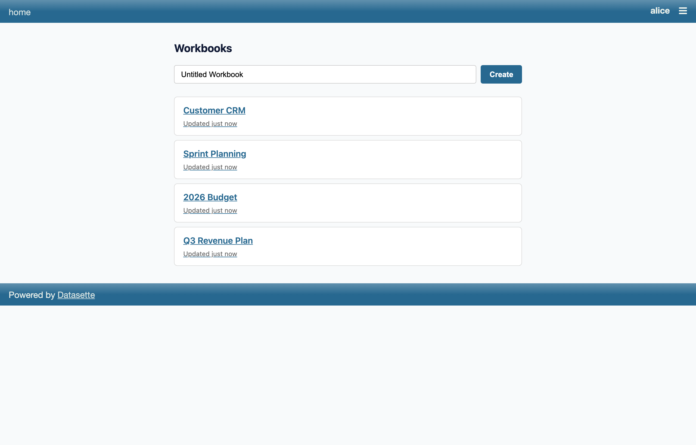
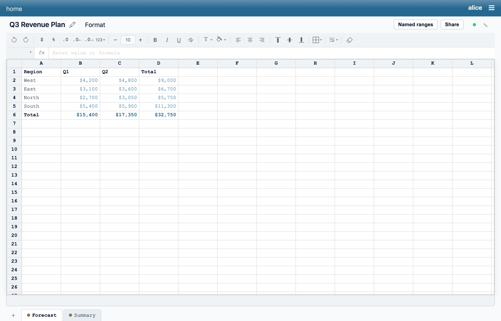
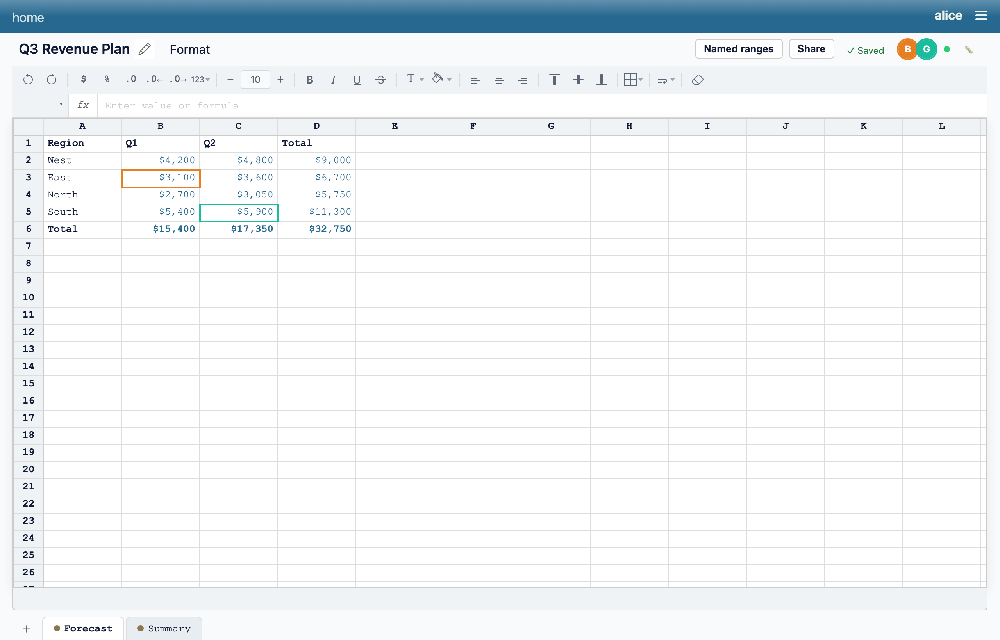

# datasette-sheets

[](https://pypi.org/project/datasette-sheets/)
[](https://github.com/datasette/datasette-sheets/releases)
[](https://github.com/datasette/datasette-sheets/actions/workflows/test.yml)
[](https://github.com/datasette/datasette-sheets/blob/main/LICENSE)

Custom spreadsheets in Datasette. Work in progress, heavy usage of LLM development. 

## Screenshots

A live spreadsheet over a Datasette database — formulas, formatting, multiple
sheets, and real-time multi-user collaboration.

The workbook list for a database:



A workbook open in the editor — `=SUM()` formulas, currency + bold formatting,
and a multi-sheet tab bar:



Real-time collaboration: edits sync over SSE, and you can see collaborators'
cursors, name labels, and avatars live as they move around the sheet:



These images are regenerated with `just shots` (see Development below).

## Installation

Install this plugin in the same environment as Datasette.
```bash
datasette install datasette-sheets
```
## Usage

Usage instructions go here.

## Permissions

datasette-sheets uses a two-layer permission model:

- **`datasette-sheets-access`** — a coarse, instance-wide gate: "can this actor
  use sheets at all". Grant it the usual way (the `permissions:` config block,
  datasette-acl, etc.). Every sheets route checks it first.
- **Per-workbook access** — resolved by
  [datasette-acl](https://github.com/datasette/datasette-acl) against the
  `sheets-workbook` resource (parent = database name, child = workbook id), via
  the `sheets-view` / `sheets-edit` / `sheets-manage` actions and the
  Viewer / Editor / Manager roles. The workbook **creator** is granted Manager
  automatically on create. Sharing is managed from the workbook's Share button.

### Upgrade behaviour (CLOSED by default)

Before this version, anyone with `datasette-sheets-access` could see and edit
**every** workbook. After upgrading, access is per-workbook. On first startup a
one-time backfill grants each existing workbook's creator (`created_by`) the
**Manager** role so owners are never locked out.

The upgrade default is **CLOSED (owner-only)**: the backfill does **not** grant
`_signed_in` or `*`, so workbooks that used to be visible to everyone become
visible only to their creator. **Existing collaborators must be explicitly
re-granted** through the Share dialog (or the datasette-acl API). Workbooks
created anonymously (no `created_by`) get no owner grant and stay inaccessible
until granted. The backfill logs a one-line summary of what it did.

## Development

To set up this plugin locally, first checkout the code. You can confirm it is available like this:
```bash
cd datasette-sheets
# Confirm the plugin is visible
uv run datasette plugins
```
To run the tests:
```bash
uv run pytest
```

### Regenerating the documentation screenshots

The screenshots above live in `docs/screenshots/` and are produced by a
self-contained Playwright script (`scripts/screenshots.mjs`). It boots a
throwaway Datasette with a fresh database, seeds a demo "Q3 Revenue Plan"
workbook (and the alice/bob/grace sharing grants), drives a headless browser —
including a three-user live-collaboration capture — then tears everything down:

```bash
just shots                       # regenerate all screenshots
just shots editor collaboration  # regenerate a subset
```

Commit the regenerated PNGs when the UI changes. The run is deterministic
(`PYTHONHASHSEED` is pinned and volatile text is frozen), so re-running with no
UI change produces no diff.
